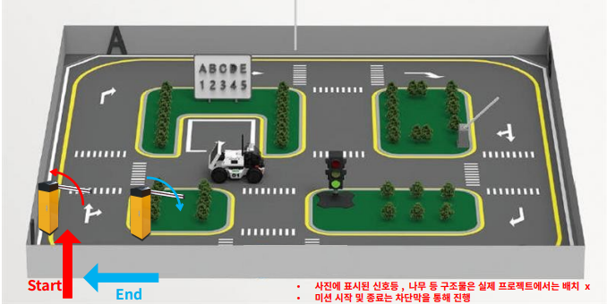
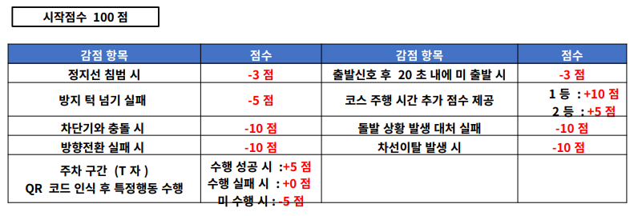

# Basic Robotics Experiment

WEGO Robotics의 Jetson Nano 기반 LIMO 로봇으로 운전면허 기능시험 코스 보조 주행 로봇 구현





## 프로젝트 목표

카메라, LiDAR, IMU, ArUco Marker를 이용해 LIMO 로봇이 기능시험 코스를 자율 주행하도록 구성

주요 기능:

- 노란색 차선 인식 기반 자율주행
- ArUco Marker 인식 후 정지, 좌회전, 우회전, 주차 동작 수행
- LiDAR 기반 장애물 및 차단기 감지 후 정지
- IMU 기반 방지턱 구간 감지 및 속도 제어
- 음성 안내 파일 재생 실험

## 사용 환경

| 항목 | 내용 |
| --- | --- |
| Robot | WEGO Robotics LIMO |
| Board | Jetson Nano |
| OS | Ubuntu 18.04 |
| ROS | ROS1 Melodic |
| Language | Python |
| Main sensors | RGB-D Camera, LiDAR, IMU |

## 패키지 구조

catkin workspace 기준 구조.

```text
limo_project/
  src/
    CMakeLists.txt
    limo_legend/
      package.xml
      CMakeLists.txt
      launch/
        start.launch
        marker.launch
      scripts/
        ar_marker.py
        control.py
        crosswalk_detect.py
        lane_detect.py
        lidar_stop.py
      audio/
        left.mp3
        park.mp3
        right.mp3
        start.mp3
        stop.mp3
```

## 실행 방법

```bash
cd ~/limo_project
catkin_make
source devel/setup.bash
roslaunch limo_legend start.launch
```

`start.launch`는 LIMO bringup, 카메라 실행, 주행 관련 노드를 한 번에 실행하기 위한 launch 파일. 현재 카메라 launch 파일은 실험 로봇의 workspace 경로 기준 참조이므로, 다른 환경에서는 `start.launch`의 카메라 include 경로 확인 필요.

## 노드 구성

| 파일 | 역할 |
| --- | --- |
| `lane_detect.py` | 카메라 이미지에서 노란색 차선 검출, 좌/우 차선 정보와 차선 기울기 값 퍼블리시 |
| `crosswalk_detect.py` | 흰색 횡단보도 패턴 검출, 횡단보도 거리 정보 퍼블리시 |
| `ar_marker.py` | ArUco Marker ID와 위치 기반 정지, 회전, 주차 명령 퍼블리시 |
| `lidar_stop.py` | LiDAR 전방 거리 기반 장애물 감지 여부와 감지 시간 퍼블리시 |
| `control.py` | 차선, 마커, LiDAR, IMU 정보를 통합해 최종 `/cmd_vel` 생성 |

## 주요 토픽 흐름

| 구분 | 토픽 |
| --- | --- |
| Camera input | `/camera/rgb/image_raw/compressed` |
| Lane output | `/limo/lane_left`, `/limo/lane_right`, `/limo/lane_connect`, `/limo/lane/accel`, `/limo/lane/gtan` |
| Crosswalk output | `/limo/crosswalk/distance` |
| Marker input/output | `/ar_pose_marker`, `/limo/marker/cmd_vel`, `/limo/marker/bool`, `/limo/marker/park` |
| LiDAR input/output | `/scan`, `/limo/lidar_warn`, `/limo/lidar_time`, `/limo/lidar/timer` |
| Control output | `/cmd_vel` |

## 기능 구현 내용

### 1. Launch 통합

문제: bringup, camera, driving node를 각각 실행해야 하는 실험 반복 비용.

접근: `start.launch`에서 필요한 launch와 주행 노드를 한 번에 실행하도록 통합. 카메라 초기화와 ArUco Marker 노드 실행 충돌을 줄이기 위해 `control.py`에서 이미지 수신 여부 확인 후 `marker.launch` 실행.

결과: `roslaunch limo_legend start.launch` 하나로 주요 주행 노드 실행 가능.

### 2. 차선 인식

문제: 왼쪽 차선만 기준으로 주행할 때 교차로와 곡선 구간에서 불안정한 주행 발생.

접근: 좌/우 하단 ROI를 각각 분리하고 두 차선의 무게중심을 함께 계산. 곡선 구간에서는 오른쪽 ROI에 침범한 왼쪽 차선으로 인한 오동작을 줄이기 위한 예외 조건 추가.

결과: 직선 구간에서는 두 차선 중심 기반 주행, 안정적인 차선 검출 시 속도 증가 조건 적용.

### 3. ArUco Marker 동작

`/ar_pose_marker`에서 얻은 3차원 위치 정보로 로봇과 마커 사이 거리 계산. Marker ID별 동작은 다음 기준.

| ID | 동작 |
| --- | --- |
| 0 | 정지 |
| 1 | 우회전 |
| 2 | 좌회전 |
| 3 | T자 주차 |

문제: 거리와 시간 기반 모션 제어만 사용할 경우 마커 배치 변화에 취약.

접근: 횡단보도 인식 결과와 차선 기울기 값(`gtan`)을 함께 사용해 방향 전환 기준점 보강.

결과: 우회전, 좌회전, 주차 구간에서 단순 시간 제어보다 안정적인 기준 확보.

### 4. LiDAR 장애물 처리

문제: 횡단보도 보행자 장애물, 차단기, 벽 또는 표지판 인식에 따른 정지 처리 필요.

접근: `/scan` 기반 전방 장애물 감지 후 정지 신호 퍼블리시. 장애물 감지가 장시간 지속될 경우 복귀 주행 시도.

결과: 장애물 감지 정지와 일부 오인식 상황의 주행 복귀 보완.

### 5. IMU 방지턱 처리

문제: 방지턱 통과 중 카메라 시야 흔들림으로 인한 차선 인식 불안정.

접근: IMU의 y축 각속도 적분으로 방지턱 통과 상태 추정. 방지턱 구간에서는 속도 감소와 차선 기반 회전 제어 제한.

결과: 방지턱 구간에서 급격한 방향 틀어짐 완화.

### 6. Voice Module

목표: 로봇 스피커를 활용한 정지, 좌회전, 우회전, 주차 안내음 재생.

접근: `pygame`으로 mp3 파일 재생, Marker 동작 상태에 따라 한 번만 재생되도록 플래그 적용.

결과: 기능 동작은 가능했으나 주행 중 지연 발생. 실제 시연에서는 제외.

## 문서

프로젝트 보고서 위치:

- `docs/중간보고서.pdf`
- `docs/결과보고서.pdf`

## 현재 한계

- `start.launch`의 카메라 launch 경로가 특정 로봇 workspace에 의존
- Marker 동작 일부가 실험으로 정한 시간 기반 모션 제어에 의존
- 음성 안내 기능은 지연 문제로 실제 시연에서 제외
